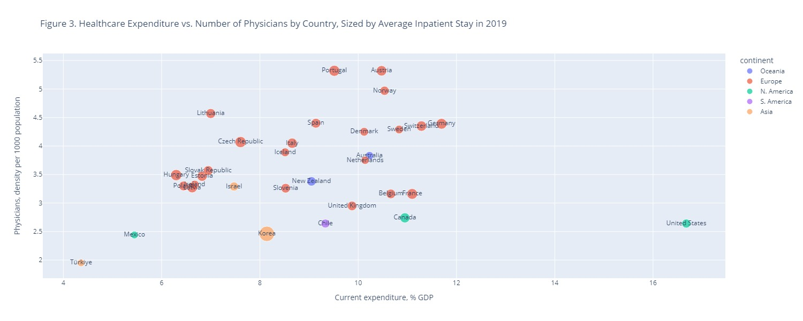
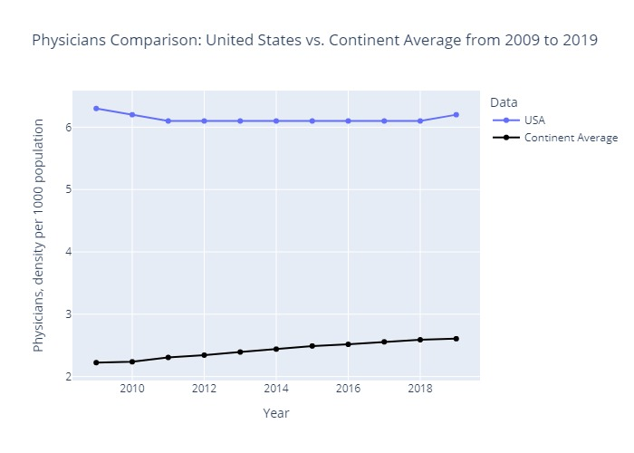

# The relationship between health expenditures and medical resources

## Description

Total health expenditure as a percentage of GDP reflects the level of a country's resources allocated to health relative to its wealth, without a 'recommended' level of spending [1]. This indicator varies significantly among countries, with some spending more or less than expected based on their income levels. In 2022, the United States (US) had the highest health expenditure among OECD member countries, allocating nearly 16 percent of its GDP to health care services [2]. The variation in health spending indicates differing national priorities and economic capacities for health investment. The objective of our work is to explore the relationship between health expenditure and medical resources.

Using the OECD Heatlh Statistics

The raw data can be found in https://www.oecd.org/els/health-systems/health-data.htm.

## Visualizations

The end goal of this was to create a Dash application to visualize the relationship between GDP allocated to Health and ratio of physicians. The US stands out as an outlier for significantly higher health expenditure. Steadily, through the last decade it exceeds the number of physicians the average North American country has. It also manages to have a steady low average length of stay and an increasing GDP.

## References

1- Health expenditure n.d. https://www.who.int/data/nutrition/nlis/info/health-expenditure (accessed February 9, 2024).

2- Healthcare spending as a percentage of GDP by country 2022. Statista n.d. https://www.statista.com/statistics/268826/health-expenditure-as-gdp-percentage-in-oecd-countries/ (accessed February 9, 2024).

## License
This project is licensed under the Creative Commons Attribution-NonCommercial-ShareAlike 4.0 International License - see the [LICENSE.md] file for details.
